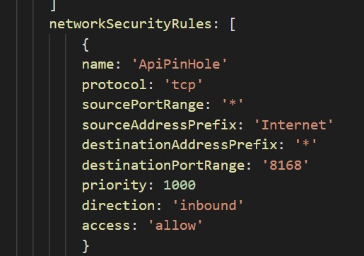
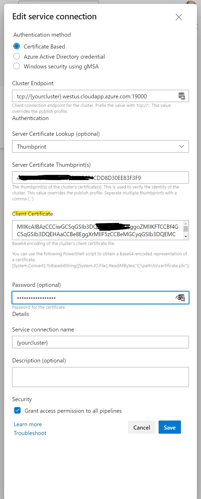

# Monitored Service Fabric Private Networking Solution
Hello! I was recently challenged to create a private networking solution for Azure Service Fabric. I’m more of a Kubernetes dude, so Service Fabric (SFC) looked like a great challenge.
First, I wanted to see if there was a managed solution rather than the [old school deployment](https://docs.microsoft.com/en-us/azure/service-fabric/service-fabric-overview) of load balancers, public Ips, NSGs, etc. individually. It turns out, there is! [Managed SFC](https://docs.microsoft.com/en-us/azure/service-fabric/overview-managed-cluster) if a newish offering in Azure that deploys all the infrastructure needed for a SFC cluster into a managed subnet without needing to fool with individual components. Yay! 

So, now on to the task of deploying Managed SFC (MSFC)! In the diagram below, you'll find how I securely deploy my service fabric cluster by using the following ancillary Azure components: 

- [Azure Key Vault](https://docs.microsoft.com/en-us/azure/key-vault/)
    - In my script, I reference a management Key Vault that I use for my [certificate password](https://www.sslmarket.com/ssl/how-to-create-an-pfx-file) AND the Managed SFC cluster password. The management Azure Key Vault references are outlined in the comments and parameters.
- [Azure Log Analytics](https://docs.microsoft.com/en-us/azure/azure-monitor/logs/data-platform-logs)
- [Azure Virtual Networks & Subnets](https://docs.microsoft.com/en-us/azure/virtual-network/)
- [Azure Load Balancer - Private](https://docs.microsoft.com/en-us/azure/load-balancer/)
- [Azure Virtual Machine](https://docs.microsoft.com/en-us/azure/virtual-machines/) 
    - In my script, I reference a subnet that I use for clients to securely connect to my SFC. A VM outside the scope of the script in this repo sits on this *"snt-sfc-clients..."* subnet to connect privately to the Managed SFC

Ok. Now on the details!

## The Script
The [main.ps1](main.ps1) script is VERY simple and it has a few required parameters. These parameters drive the architecture deployment. 

If you decide NOT to supply the mandatory parameters, the script will create the needed Azure infrastructure using my naming convention. Feel free to modify the script if you don't either like my naming convention or just want to hardcode your own variables for your environment.

|Parameter |Function |Required?
---| ---| ---|
|`-location`|Azure location for Your Resources |Yes 
|`-customerName`|Service Fabric Cluster Signifier |Yes
|`-lawWorkspaceName`| Log Analytics Workspace Name | No
|`-lawWorkspaceRg`| Log Analytics Workspace Resource Group | No
|`-adminGrp`| Azure AD Security Group to Assign Admin Rights to the Resources | Yes
|`-environ`| Operating Environment Signifier (e.g. prd for Production) | Yes
|`-mgmtAkv`| Management Key Vault containing .PFX passphrase and local admin password for cluster nodes| Yes

### How the Script Works
The script looks at your Azure context via PowerShell (v5.1.x) and then will take script parameters (e.g. your subscription ID) and supply them to the Azure Bicep templates also found in this directory.

## The Diagram by the Numbers
Take a look at the diagram below. The **green numbers** correspond to the numbered list below the diagram to explain how the script deploys this Managed Service Fabric for us.


### **Diagram Legend**
Each numbered step goes through something the [.\main.ps1](main.ps1) does on your local Windows environment. I wanted to use PowerShell 7.x to make this process cross-platform but the cryptographic providers aren't up to snuff on the 7.x PowerShell release as of this writing.

1. This step outlines the certificate creation needed to authenticate (AuthN) to the Managed Azure Service Fabric Cluster (MSFC) after it is created. The script does the following:
    1. Check to see if you already have a certificate matching the name of the cluster name in your local filesystem. If so, it pulls the thumbprint from it and uploads both the thumbprint and the certificate itself to the Azure Key Vault created later in the script.
    2. If you don't have a local cert but have a certificate matching the cluster name *on your Azure Key Vault*, then it will pull the certificate from Azure Key Vault, archive it to your local machine and import it to your local certificate store. It will then use the thumbprint from the downloaded certificate to use as AuthN to the created MSFC 
    3. If you don't have either local certificate or Azure Key Vault certificate matching the cluster name, it will create a local certificate and then upload it to the newly created Azure Key Vault.&nbsp;

<br>

2.  This portion illustrates using the certificate described in #1 above to connect to the cluster endpoint which is outputted towards the end of the script. NOTE: this is a MSFC artifact. 
&nbsp;
3. Next, the script HEAVILY modifies both the MSFC and the MSFC's Node Types (NT) from default configuration. Think of NTs as the compute brains behind the MSFC or like node pools in K8s. 
    - The MSFC's NTs have monitoring configurations pointing to Azure Log Analytics workspace that we'll get talk about in step #5. Also defined in this step is the cluster admin username and password. 
    - While the password is retrieved from the Management Azure Key Vault (outside the scope of this script), the **username** is defined in this portion of the script:

        ``## Mgmt Azure Variables (See README.md) <--- change these as needed ############################``

        Make sure to change this section as needed.
    - The NT configuration also has a single port needed for cluster operation open to the web. This is specific to my needs and you may not need it. If you don't this/keep the MSFC completely private or want to allow something else through to the MSFC from the internet, modify the following area of the Azure Bicep file that corresponds to your environment:

    
    
    - **Important** The cluster's size (and OS & other parameters...) is defined in the Azure Bicep file, too. Make sure to change number *numClusterNodes* and *clusterSku* accordingly. Here's a [reference on sizing](https://docs.microsoft.com/en-us/azure/service-fabric/overview-managed-cluster#service-fabric-managed-cluster-skus).

&nbsp;
4. Here's the secret sauce. A private load balancer is deployed and then updates the backend MSFC nodes (deployed as an Azure VM Scale Set). This is done using the [nested_VmssUpdate.bicep](./ilb/nested_VmssUpdate.bicep). *If you need to tweak or further tighten security on the nodes, you'll need to modify the both the [MSFC](./sf/sfmanaged-tst.bicep) bicep portion by modifying the networkSecurityRules section as mentioned above in Step #3 and the VMSS update.*
   
<br>
5. Alerting and monitoring on the MSFC was actually a subject of a support request I sent to Microsoft Support. In the past, you could enable logging and there were references to alerting and monitoring with old school non-managed SFCs, but not the Managed SFC flavor. Microsoft addressed this with a revision to their API and I have incorporated this into my script. Two of the script parameters, ```-lawWorkspaceName``` and ```-lawWorkspaceRg``` allow you to specify an existing [Log Analytics Workspace](https://docs.microsoft.com/en-us/azure/service-fabric/service-fabric-diagnostics-event-analysis-oms) workspace (LAW) for monitoring.  
   
   - Unfortunately, only specifying LAWS in the templates doesn't really give you decent insight into what's happening on the MSFC. I've taken some of the Windows Diagnostic configs and incorporated them into the templates you'll find here. If you need to modify it, look for the **WADcfg** area as shown below:

           <br> <br> 
    - Also, you'll need to enable your LAWS to collect the appropriate *Windows Events* logs from your cluster nodes. Take a look at [jagilber's repo](https://github.com/jagilber) and he shows you how to manually add these settings to your Log Analytics workspace. These settings are critical for the out-of-the-box [Service Fabric "solution" ](https://docs.microsoft.com/en-us/azure/service-fabric/service-fabric-diagnostics-event-analysis-oms)in Log Analytics to work properly.
    - Just like the *Windows Events* logs, you'll need to configure your Log Analytics workspace to "look" at storage accounts collecting MSFC performance data so that you can see that data in the LAWS solution. You'll navigate to your LAWS, click **Storage Account logs** on the configuration blade, **"+ Add"** and then configure the Storage Account config as below:
    <br>
    <br>
    

6. My deployments wouldn't be complete if I didn't surface up the information needed for Azure DevOps's Pipelines. Essentially, connecting Managed Service Fabric clusters aren't as a straight-forward as you might have guessed. You need to copy and paste the RSA-SHA from the script output in your own pipelines for deployment.

- DevOps Connection Info. You'll need to ensure you paste in the output from the script into your Azure DevOps Service Connection
    - Script output that goes into the Azure DevOps Service Connection panel is:
    
    
    - The Azure DevOps Service Connection properties where you paste the output is:
    
&nbsp;

# Conclusion
Whew. That's a lot of configuration but the script gives you everything you need to deploy a MSFC and connect it to Azure DevOps. Please holler at me if you have questions and I will HAPPILY accept PRs! 
&nbsp; <br> <br>
Cheers!


